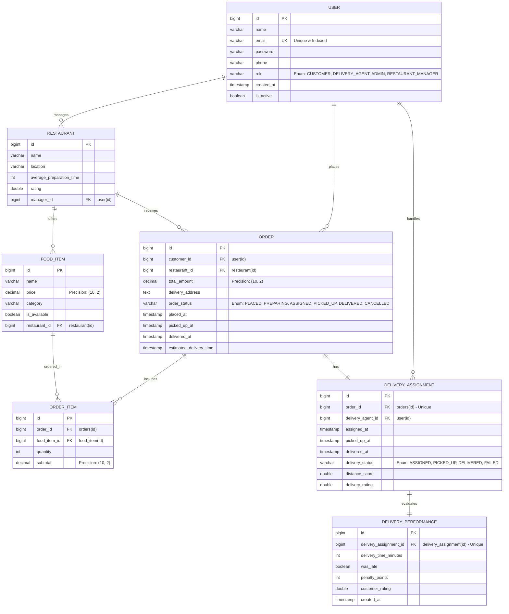
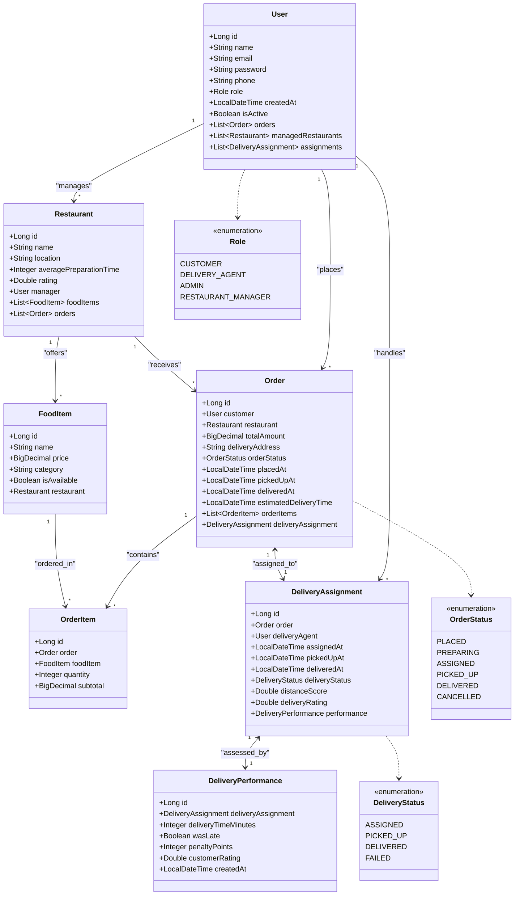

# Food Delivery Platform - Database & JPA Architecture Design

This document details the Entity-Relationship (ER) diagram, the Object-Oriented Class diagram, and the corresponding Spring Boot + JPA Entity designs optimized for the Food Delivery Platform.

---

## 1. Entity-Relationship (ER) Diagram
This diagram represents the relational database schema, detailing keys (Primary Keys, Foreign Keys, Unique Keys), column data types, and structural constraints.



---

## 2. Object-Oriented Class Diagram
This diagram represents the JPA Entity classes in Spring Boot, depicting relations, types, and primary enumerations.



---

## 3. Spring Boot + JPA Implementation Code
Below are clean, optimized JPA entities utilizing Lombok annotations and standard best practices.

### Enums

```java
package com.delivery.model;

public enum Role {
    CUSTOMER,
    DELIVERY_AGENT,
    ADMIN,
    RESTAURANT_MANAGER
}

public enum OrderStatus {
    PLACED,
    PREPARING,
    ASSIGNED,
    PICKED_UP,
    DELIVERED,
    CANCELLED
}

public enum DeliveryStatus {
    ASSIGNED,
    PICKED_UP,
    DELIVERED,
    FAILED
}
```

### 1. User Entity
```java
package com.delivery.entity;

import com.delivery.model.Role;
import jakarta.persistence.*;
import lombok.*;
import org.hibernate.annotations.CreationTimestamp;
import java.time.LocalDateTime;
import java.util.ArrayList;
import java.util.List;

@Entity
@Table(name = "users", indexes = {
    @Index(name = "idx_user_email", columnList = "email", unique = true),
    @Index(name = "idx_user_role", columnList = "role")
})
@Getter
@Setter
@NoArgsConstructor
@AllArgsConstructor
@Builder
public class User {

    @Id
    @GeneratedValue(strategy = GenerationType.IDENTITY)
    private Long id;

    @Column(nullable = false)
    private String name;

    @Column(nullable = false, unique = true)
    private String email;

    @Column(nullable = false)
    private String password;

    private String phone;

    @Enumerated(EnumType.STRING)
    @Column(nullable = false, length = 30)
    private Role role;

    @CreationTimestamp
    @Column(name = "created_at", nullable = false, updatable = false)
    private LocalDateTime createdAt;

    @Column(name = "is_active", nullable = false)
    @Builder.Default
    private Boolean isActive = true;

    // One customer places many orders
    @OneToMany(mappedBy = "customer", cascade = CascadeType.ALL, orphanRemoval = true)
    @Builder.Default
    private List<Order> orders = new ArrayList<>();

    // One restaurant manager manages many restaurants
    @OneToMany(mappedBy = "manager", cascade = CascadeType.ALL, orphanRemoval = true)
    @Builder.Default
    private List<Restaurant> managedRestaurants = new ArrayList<>();

    // One delivery agent handles many delivery assignments
    @OneToMany(mappedBy = "deliveryAgent")
    @Builder.Default
    private List<DeliveryAssignment> assignments = new ArrayList<>();
}
```

### 2. Restaurant Entity
```java
package com.delivery.entity;

import jakarta.persistence.*;
import lombok.*;
import java.util.ArrayList;
import java.util.List;

@Entity
@Table(name = "restaurants", indexes = {
    @Index(name = "idx_restaurant_manager", columnList = "manager_id")
})
@Getter
@Setter
@NoArgsConstructor
@AllArgsConstructor
@Builder
public class Restaurant {

    @Id
    @GeneratedValue(strategy = GenerationType.IDENTITY)
    private Long id;

    @Column(nullable = false)
    private String name;

    @Column(nullable = false)
    private String location;

    @Column(name = "average_preparation_time")
    private Integer averagePreparationTime; // in minutes

    private Double rating;

    @ManyToOne(fetch = FetchType.LAZY)
    @JoinColumn(name = "manager_id", nullable = false)
    private User manager;

    @OneToMany(mappedBy = "restaurant", cascade = CascadeType.ALL, orphanRemoval = true)
    @Builder.Default
    private List<FoodItem> foodItems = new ArrayList<>();

    @OneToMany(mappedBy = "restaurant")
    @Builder.Default
    private List<Order> orders = new ArrayList<>();
}
```

### 3. FoodItem Entity
```java
package com.delivery.entity;

import jakarta.persistence.*;
import lombok.*;
import java.math.BigDecimal;

@Entity
@Table(name = "food_items", indexes = {
    @Index(name = "idx_food_item_restaurant", columnList = "restaurant_id")
})
@Getter
@Setter
@NoArgsConstructor
@AllArgsConstructor
@Builder
public class FoodItem {

    @Id
    @GeneratedValue(strategy = GenerationType.IDENTITY)
    private Long id;

    @Column(nullable = false)
    private String name;

    @Column(nullable = false, precision = 10, scale = 2)
    private BigDecimal price;

    private String category;

    @Column(name = "is_available", nullable = false)
    @Builder.Default
    private Boolean isAvailable = true;

    @ManyToOne(fetch = FetchType.LAZY)
    @JoinColumn(name = "restaurant_id", nullable = false)
    private Restaurant restaurant;
}
```

### 4. Order Entity
```java
package com.delivery.entity;

import com.delivery.model.OrderStatus;
import jakarta.persistence.*;
import lombok.*;
import org.hibernate.annotations.CreationTimestamp;
import java.math.BigDecimal;
import java.time.LocalDateTime;
import java.util.ArrayList;
import java.util.List;

@Entity
@Table(name = "orders", indexes = {
    @Index(name = "idx_orders_customer", columnList = "customer_id"),
    @Index(name = "idx_orders_restaurant", columnList = "restaurant_id"),
    @Index(name = "idx_orders_status", columnList = "order_status")
})
@Getter
@Setter
@NoArgsConstructor
@AllArgsConstructor
@Builder
public class Order {

    @Id
    @GeneratedValue(strategy = GenerationType.IDENTITY)
    private Long id;

    @ManyToOne(fetch = FetchType.LAZY)
    @JoinColumn(name = "customer_id", nullable = false)
    private User customer;

    @ManyToOne(fetch = FetchType.LAZY)
    @JoinColumn(name = "restaurant_id", nullable = false)
    private Restaurant restaurant;

    @Column(name = "total_amount", nullable = false, precision = 10, scale = 2)
    private BigDecimal totalAmount;

    @Column(name = "delivery_address", nullable = false, columnDefinition = "TEXT")
    private String deliveryAddress;

    @Enumerated(EnumType.STRING)
    @Column(name = "order_status", nullable = false, length = 30)
    private OrderStatus orderStatus;

    @CreationTimestamp
    @Column(name = "placed_at", nullable = false, updatable = false)
    private LocalDateTime placedAt;

    @Column(name = "picked_up_at")
    private LocalDateTime pickedUpAt;

    @Column(name = "delivered_at")
    private LocalDateTime deliveredAt;

    @Column(name = "estimated_delivery_time")
    private LocalDateTime estimatedDeliveryTime;

    @OneToMany(mappedBy = "order", cascade = CascadeType.ALL, orphanRemoval = true)
    @Builder.Default
    private List<OrderItem> orderItems = new ArrayList<>();

    @OneToOne(mappedBy = "order", cascade = CascadeType.ALL, fetch = FetchType.LAZY)
    private DeliveryAssignment deliveryAssignment;
}
```

### 5. OrderItem Entity
```java
package com.delivery.entity;

import jakarta.persistence.*;
import lombok.*;
import java.math.BigDecimal;

@Entity
@Table(name = "order_items", indexes = {
    @Index(name = "idx_order_items_order", columnList = "order_id"),
    @Index(name = "idx_order_items_food", columnList = "food_item_id")
})
@Getter
@Setter
@NoArgsConstructor
@AllArgsConstructor
@Builder
public class OrderItem {

    @Id
    @GeneratedValue(strategy = GenerationType.IDENTITY)
    private Long id;

    @ManyToOne(fetch = FetchType.LAZY)
    @JoinColumn(name = "order_id", nullable = false)
    private Order order;

    @ManyToOne(fetch = FetchType.LAZY)
    @JoinColumn(name = "food_item_id", nullable = false)
    private FoodItem foodItem;

    @Column(nullable = false)
    private Integer quantity;

    @Column(nullable = false, precision = 10, scale = 2)
    private BigDecimal subtotal;
}
```

### 6. DeliveryAssignment Entity
```java
package com.delivery.entity;

import com.delivery.model.DeliveryStatus;
import jakarta.persistence.*;
import lombok.*;
import java.time.LocalDateTime;

@Entity
@Table(name = "delivery_assignments", indexes = {
    @Index(name = "idx_delivery_agent", columnList = "delivery_agent_id"),
    @Index(name = "idx_delivery_order", columnList = "order_id", unique = true)
})
@Getter
@Setter
@NoArgsConstructor
@AllArgsConstructor
@Builder
public class DeliveryAssignment {

    @Id
    @GeneratedValue(strategy = GenerationType.IDENTITY)
    private Long id;

    @OneToOne(fetch = FetchType.LAZY)
    @JoinColumn(name = "order_id", nullable = false, unique = true)
    private Order order;

    @ManyToOne(fetch = FetchType.LAZY)
    @JoinColumn(name = "delivery_agent_id", nullable = false)
    private User deliveryAgent;

    @Column(name = "assigned_at")
    private LocalDateTime assignedAt;

    @Column(name = "picked_up_at")
    private LocalDateTime pickedUpAt;

    @Column(name = "delivered_at")
    private LocalDateTime deliveredAt;

    @Enumerated(EnumType.STRING)
    @Column(name = "delivery_status", nullable = false, length = 30)
    private DeliveryStatus deliveryStatus;

    @Column(name = "distance_score")
    private Double distanceScore;

    @Column(name = "delivery_rating")
    private Double deliveryRating;

    @OneToOne(mappedBy = "deliveryAssignment", cascade = CascadeType.ALL, fetch = FetchType.LAZY)
    private DeliveryPerformance performance;
}
```

### 7. DeliveryPerformance Entity
```java
package com.delivery.entity;

import jakarta.persistence.*;
import lombok.*;
import org.hibernate.annotations.CreationTimestamp;
import java.time.LocalDateTime;

@Entity
@Table(name = "delivery_performance", indexes = {
    @Index(name = "idx_perf_assignment", columnList = "delivery_assignment_id", unique = true)
})
@Getter
@Setter
@NoArgsConstructor
@AllArgsConstructor
@Builder
public class DeliveryPerformance {

    @Id
    @GeneratedValue(strategy = GenerationType.IDENTITY)
    private Long id;

    @OneToOne(fetch = FetchType.LAZY)
    @JoinColumn(name = "delivery_assignment_id", nullable = false, unique = true)
    private DeliveryAssignment deliveryAssignment;

    @Column(name = "delivery_time_minutes")
    private Integer deliveryTimeMinutes;

    @Column(name = "was_late", nullable = false)
    private Boolean wasLate;

    @Column(name = "penalty_points")
    private Integer penaltyPoints;

    @Column(name = "customer_rating")
    private Double customerRating;

    @CreationTimestamp
    @Column(name = "created_at", nullable = false, updatable = false)
    private LocalDateTime createdAt;
}
```

---

## 4. Spring + JPA Best Practices & Optimizations

### 1. N+1 Query Prevention
- **Issue**: Standard `@ManyToOne` and `@OneToOne` default to `FetchType.EAGER` in JPA. This will cause N+1 database hits when pulling list data.
- **Solution**: All relationships above are explicitly set to `FetchType.LAZY`. Utilize dynamic JPA `JOIN FETCH` queries, Entity Graphs, or Spring Data Projection when pulling complete entity graphs.

### 2. Precise Currency Handling
- **Issue**: Floating-point types (`float`, `double`) cause roundoff errors during financial calculations.
- **Solution**: Every financial field (`price`, `totalAmount`, `subtotal`) utilizes `java.math.BigDecimal` mapped to high-precision SQL columns (`precision = 10, scale = 2`).

### 3. Lombok `@Data` Danger
- **Issue**: Standard Lombok `@Data` overrides `equals()`, `hashCode()`, and `toString()`. When loading lazy relationships inside lists, this can cause cyclic evaluations ending in `StackOverflowError` or database session exceptions.
- **Solution**: Utilized explicit `@Getter` and `@Setter` instead of `@Data`, avoiding automated relationship nesting in standard methods.

### 4. Database Indexing strategy
- Foreign keys and frequently queried attributes are indexed via explicit `@Index` definitions to guarantee sub-millisecond query performance as the transaction volumes grow.
