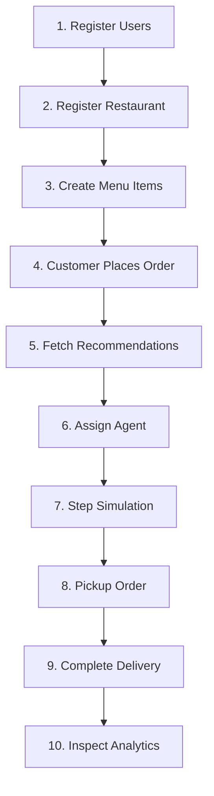

# Food Delivery System - Postman API Testing Guide

This guide describes all REST API endpoints for your Spring Boot backend and provides a step-by-step end-to-end testing scenario using Postman.

---

## 1. API Endpoints Catalog

### 🔐 Authentication Module (`/api/auth`)

#### 1.1 Register User
* **Method**: `POST`
* **URL**: `http://localhost:8080/api/auth/register`
* **Headers**: `Content-Type: application/json`
* **JSON Body**:
```json
{
  "name": "Alex Rider",
  "email": "alex@delivery.com",
  "password": "securepassword",
  "phone": "9876543210",
  "role": "DELIVERY_AGENT",
  "x": 10,
  "y": 10,
  "zone": "Downtown"
}
```
> [!NOTE]
> Roles can be: `CUSTOMER`, `DELIVERY_AGENT`, `ADMIN`, `RESTAURANT_MANAGER`. Coordinates `x` and `y` must be between `0` and `100`.

#### 1.2 Login User
* **Method**: `POST`
* **URL**: `http://localhost:8080/api/auth/login`
* **Headers**: `Content-Type: application/json`
* **JSON Body**:
```json
{
  "email": "alex@delivery.com",
  "password": "securepassword"
}
```

#### 1.3 Update Agent Location
* **Method**: `PUT`
* **URL**: `http://localhost:8080/api/auth/users/1/location?x=15&y=22`
* **Headers**: None

---

### 🍔 Restaurant Module (`/api/restaurants`)

#### 2.1 Create Restaurant
* **Method**: `POST`
* **URL**: `http://localhost:8080/api/restaurants`
* **Headers**: `Content-Type: application/json`
* **JSON Body**:
```json
{
  "name": "Pizzeria Milan",
  "location": "Downtown",
  "averagePreparationTime": 20,
  "rating": 4.8,
  "managerId": 2,
  "x": 25,
  "y": 30
}
```
> [!IMPORTANT]
> The `managerId` must belong to a user registered with the `RESTAURANT_MANAGER` role.

#### 2.2 Add Food Item to Menu
* **Method**: `POST`
* **URL**: `http://localhost:8080/api/restaurants/menu`
* **Headers**: `Content-Type: application/json`
* **JSON Body**:
```json
{
  "name": "Margherita Pizza",
  "price": 12.99,
  "category": "Main Course",
  "restaurantId": 1
}
```

#### 2.3 Fetch Restaurant Menu
* **Method**: `GET`
* **URL**: `http://localhost:8080/api/restaurants/1/menu`

---

### 📦 Order Module (`/api/orders`)

#### 3.1 Place Order
* **Method**: `POST`
* **URL**: `http://localhost:8080/api/orders`
* **Headers**: `Content-Type: application/json`
* **JSON Body**:
```json
{
  "customerId": 3,
  "restaurantId": 1,
  "deliveryAddress": "456 Oak Lane, Downtown",
  "deliveryX": 60,
  "deliveryY": 65,
  "items": [
    {
      "foodItemId": 1,
      "quantity": 2
    }
  ]
}
```

#### 3.2 Track Order Lifecycle Status
* **Method**: `GET`
* **URL**: `http://localhost:8080/api/orders/1`

---

### 🚴 Delivery Assignment Engine (`/api/assignments`)

#### 4.1 Get Recommended Agents (Core Scoring Engine)
* **Method**: `GET`
* **URL**: `http://localhost:8080/api/assignments/recommend?orderId=1`
* **Description**: Returns agents sorted by recommendation score based on rating, distance, workload, and delays.

#### 4.2 Assign Agent to Order
* **Method**: `POST`
* **URL**: `http://localhost:8080/api/assignments/assign?orderId=1&agentId=1`
* **Description**: Associates an agent with the order and transitions order status to `ASSIGNED`. Enforces the *One Agent = One Active Delivery* rule.

#### 4.3 Agent Pickup Order
* **Method**: `PUT`
* **URL**: `http://localhost:8080/api/assignments/1/pickup`
* **Description**: Transitions status to `PICKED_UP`. Triggers preparation delay tracking.

#### 4.4 Agent Deliver Order
* **Method**: `PUT`
* **URL**: `http://localhost:8080/api/assignments/1/deliver?rating=4.5`
* **Description**: Transitions status to `DELIVERED`, logs delivery time, and applies rating penalties if late.

---

### 🚗 Grid Coordinates Simulation (`/api/simulation`)

#### 5.1 Tick Coordinate Step
* **Method**: `POST`
* **URL**: `http://localhost:8080/api/simulation/step`
* **Description**: Simulates active agents moving 15 units closer to their targets in real time. Inspect agent coordinate locations afterwards using `/api/auth/users/{agentId}`.

---

### 📊 Performance Reports (`/api/reports`)

#### 6.1 Top Agents
* **Method**: `GET`
* **URL**: `http://localhost:8080/api/reports/top-agents`

#### 6.2 Delayed Deliveries Log
* **Method**: `GET`
* **URL**: `http://localhost:8080/api/reports/delayed-deliveries`

#### 6.3 Restaurant Delay Performance
* **Method**: `GET`
* **URL**: `http://localhost:8080/api/reports/restaurant-delays`

---

## 2. Step-by-Step Testing Walkthrough

Follow this 10-step script to test every industrial rule in Postman:



### Step 1: Register Users
Create 3 accounts representing different roles.
1. **Restaurant Manager**:
   * `POST` to `/api/auth/register`
   * Body:
     ```json
     { "name": "Manager Mark", "email": "mark@mgr.com", "password": "pass", "phone": "1", "role": "RESTAURANT_MANAGER", "x": 0, "y": 0 }
     ```
2. **Delivery Agent**:
   * `POST` to `/api/auth/register`
   * Body:
     ```json
     { "name": "Agent Arthur", "email": "arthur@agent.com", "password": "pass", "phone": "2", "role": "DELIVERY_AGENT", "x": 10, "y": 10, "zone": "Downtown" }
     ```
3. **Customer**:
   * `POST` to `/api/auth/register`
   * Body:
     ```json
     { "name": "Customer Clara", "email": "clara@cust.com", "password": "pass", "phone": "3", "role": "CUSTOMER", "x": 50, "y": 50 }
     ```

### Step 2: Register Restaurant
Assign the restaurant to Manager Mark (`managerId: 1`) located at coordinate `(x: 15, y: 15)`.
* `POST` to `/api/restaurants`
* Body:
  ```json
  { "name": "Burger Junction", "location": "Downtown", "averagePreparationTime": 15, "rating": 5.0, "managerId": 1, "x": 15, "y": 15 }
  ```

### Step 3: Create Menu Item
Add food to Burger Junction (`restaurantId: 1`).
* `POST` to `/api/restaurants/menu`
* Body:
  ```json
  { "name": "Double Cheeseburger", "price": 9.99, "category": "Burgers", "restaurantId": 1 }
  ```

### Step 4: Customer Places Order
Clara (`customerId: 3`) orders 2 burgers from Burger Junction (`restaurantId: 1`), requesting delivery to coordinates `(x: 55, y: 55)`.
* `POST` to `/api/orders`
* Body:
  ```json
  {
    "customerId": 3,
    "restaurantId": 1,
    "deliveryAddress": "789 Pine Ave",
    "deliveryX": 55,
    "deliveryY": 55,
    "items": [
      { "foodItemId": 1, "quantity": 2 }
    ]
  }
  ```

### Step 5: Fetch Recommendations
Inspect recommendations for Order 1. Our scoring algorithm evaluates coordinates distance and history:
* `GET` to `/api/assignments/recommend?orderId=1`
* *Observe score calculations in the JSON list response.*

### Step 6: Assign Agent
Assign Arthur (`agentId: 2`) to Order 1.
* `POST` to `/api/assignments/assign?orderId=1&agentId=2`
* > [!TIP]
  > Try repeating this assignment request for a second order. The system will block it under **Rule 1 (One Agent = One Active Delivery)**!

### Step 7: Step Grid Simulation
Move Arthur closer to the restaurant coordinates `(15, 15)` from `(10, 10)`.
* `POST` to `/api/simulation/step`
* Check coordinates via `GET` to `/api/auth/users/2`. Arthur is now at `(15, 15)`!

### Step 8: Pickup Order
Mark order pickup.
* `PUT` to `/api/assignments/1/pickup`
* > [!TIP]
  > Try reassigning the order after pickup. The system blocks it under **Rule 3 (Cannot Reassign After Pickup)**!

### Step 9: Deliver Order
Conclude delivery and provide customer rating of 4.5.
* `PUT` to `/api/assignments/1/deliver?rating=4.5`
* Calculates automatic duration and applies rating penalties if delivery was late.

### Step 10: Inspect Analytics
Fetch the final operational reports:
* `GET` to `/api/reports/top-agents`
* `GET` to `/api/reports/restaurant-delays`
